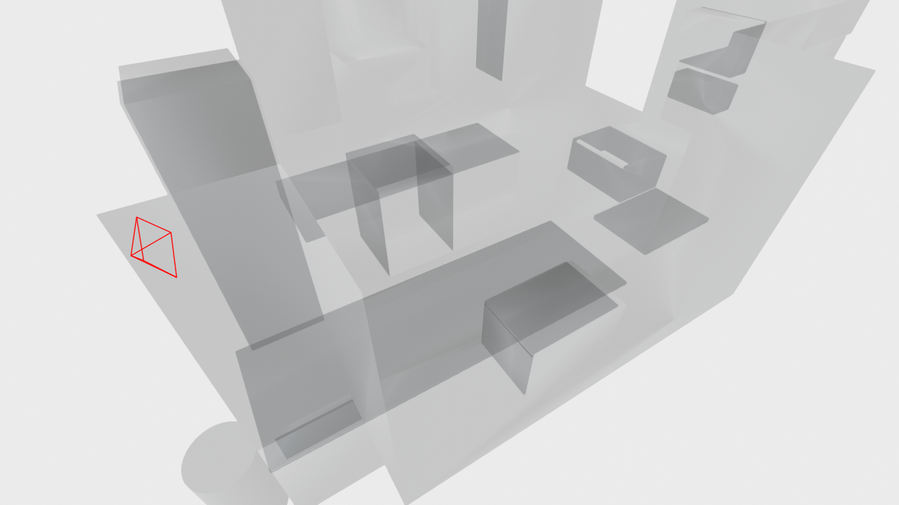

# HD-EPIC Camera Pose Reading Without VRS

This repository contains helper code to read camera poses that correspond to **mp4_frames**, without the need of the VRS. 

First, download the `intermediate_data/` at [Temporary Link](https://uob-my.sharepoint.com/:u:/g/personal/ms21614_bristol_ac_uk/IQCybo9ggvtbQpf8akG3EbZZAYzz2bwO6LiZPVEyz2amjqA?e=uQ6Amy).
Then, structure the data directory following instruction below.
The `intermediate_data/` include pre-extracted _intrinsics, calibration and camera poses_ of 155 / 156 videos. The video `P03-20240217-130208` is currently not included.

This code and the extracted data are not strictly tested; for absolutely guaranteed data loading, please use raw VRS files.

What this repo contains:
- Code to read camera pose at _mp4_frames_
- Code to visualize camera poses

# Example usage

see `example.py`.

```python
from novrs_lib.novrs_reader_basic import NoVRSReader

# Example usage
vid = 'P01-20240202-161948'
frame = 100
reader = NoVRSReader(vid=vid, 
                     storage_dir='./hdepic_storage',)

# 1. Load the camera pose at a specified frame
cam_poses = reader.load_pinholecw90_trajectory()
cam_pose = cam_poses[frame]

# 2. Visualise the camera pose at this frame
from hovering_lib.hover_drawer import HoverDrawer
from PIL import Image
drawer = HoverDrawer(reader)
rend = drawer.render_frame(frame)
Image.fromarray(rend).save(f'{vid}_frame{frame:04d}_rendered.png')
``` 

Visualised output example:



Other functionalities that require `calibration` is also supported:
```python
... 
# 3. Undistort images using calibration info stored in intermediate_data/ 
reader_with_mp4 = NoVRSReader(vid=vid, 
                        load_mp4=True,
                        storage_dir='./hdepic_storage',)
img = reader_with_mp4.read_mp4_frame(frame, undistort=False)
img_undistorted = reader_with_mp4.undistort_image(img)

# 4. Or do other things with reader.rgb_camera_calibration. (omitted)
```

## Data Directory Structure

The expected directory structure is as follows:

```
hdepic_storage
├── Videos
│   └── P01
│       ├──P01-20240202-161948.mp4
│       ├──P01-20240202-161948_mp4_to_vrs_time_ns.csv
│       ...
|── intermediate_data
    └── pinholecw90_poses       # Optional Pre-extracted camera poses
    |---mp4_trajectory 
    |---rgb_camera_calibration
├── Digital-Twin                # Optional for visualisation
│   └── meshes
│       ├── P01
│       ...
```


## Requirements

- `numpy`
- `projectaria_tools`
- `decord`
- `open3d`          # if visualisation is needed
- `opencv-python`   # if visualisation is needed
